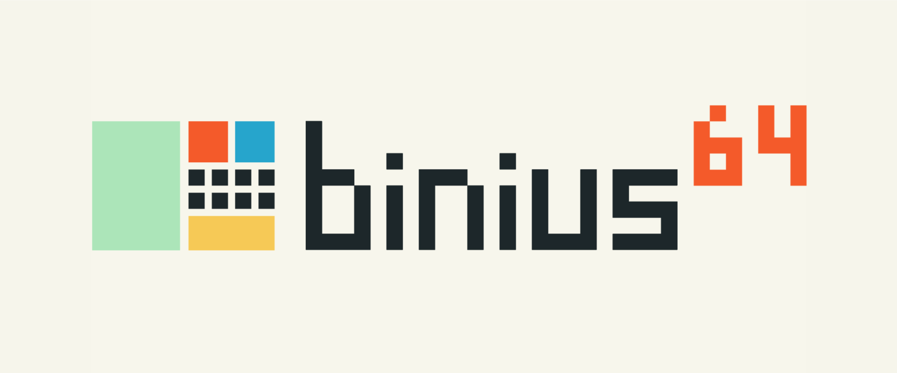

# Binius64

Binius64 is a zero-knowledge succinct argument system (zk-SNARK), implemented in Rust. Binius64 is capable of proving arbitrary computations, expressed as non-deterministic circuits over 64-bit words.

Binius64 is a successor to the [original Binius protocol](https://github.com/IrreducibleOSS/binius), with a focus on simplicity and CPU performance. The constraint system natively encodes bitwise operations on 64-bit words through *shifted value indices*, which combine value references with shift operations. This design achieves a 64-fold reduction in constraint complexity compared to bit-level approaches while maintaining the efficiency advantages of binary field arithmetic. The protocol targets modern 64-bit CPUs with SIMD instructions, making it practical for real-world applications requiring zero-knowledge proofs.

For further documentation, visit

* The [binius.xyz](https://www.binius.xyz) documentation website.
  * The [Blueprint](https://www.binius.xyz/blueprint) section provides a detailed description of the Binius64 cryptographic protocol.
  * The [Building](https://www.binius.xyz/building) section contains practical guides for how to build and prove applications using Binius64.
* The Rust docs at [docs.binius.xyz](https://docs.binius.xyz).
* Irreducible's post [Announcing Binius64](https://www.irreducible.com/posts/announcing-binius64).

## Dependencies

- [rustup](https://rustup.rs/): We recommend using rustup to install the Rust compiler and Cargo toolchain.

## Usage

### Building

Binius64 implements optimizations for certain target architectures. To enable these, export the environment variable

```bash
export RUSTFLAGS="-C target-cpu=native"
```

When including binius64 as a dependency, it is recommended to add the following lines to your `Cargo.toml` file to have optimizations across crates

```toml
[profile.release]
lto = "thin"
```

### Running Examples

The `prover/examples/` directory contains example circuits, which you can run using the [CLI framework](https://www.binius.xyz/building/getting-started/cli).

For example, to run an example proving a SHA-512 preimage:

```bash
$ RUSTFLAGS="-Ctarget-cpu=native" cargo run --release --example sha512 prove --max-len-bytes 65536 --exact-len-bytes
   Finished `release` profile [optimized + debuginfo] target(s) in 0.09s
     Running `target/release/examples/sha512 prove --max-len-bytes 65536 --exact-len`
Building circuit [ 2.99s | 100.00% ]

Setup [ 619.81ms | 100.00% ] { log_inv_rate = 1 }

Generating witness [ 14.12ms | 100.00% ]
├── Input population [ 173.34µs | 1.23% ]
└── Circuit evaluation [ 12.60ms | 89.22% ]

prove [ 128.58ms | 100.00% ] { operation = prove, perfetto_category = operation, n_witness_words = 1048576, n_bitand = 1048576, n_intmul = 1 }
...
```

### Disabling multithreading

Multithreading is enabled by default using [Rayon](https://github.com/rayon-rs/rayon). This is controlled by the `rayon` Cargo feature. To run an example with multithreading disabled, use `--no-default-features`.

## Repo Structure

Binius64 consists of several specialized crates, which are split between two directories, `verifier/` and `prover/`. These directories contains the project's Verifier and Prover, respectively, which are offered under different licensing terms. See the [Licensing](#licensing) section below for information. The Prover crates depend on the Verifier crates, but Verifier crates do _not_ depend on Prover crates.

Verifier:

- **binius-circuits**: Standard library of circuit gadgets
- **binius-core**: Modules shared by the frontend and verifier
- **binius-field**: Binary field arithmetic with platform-specific optimizations
- **binius-frontend**: Circuit construction and compilation framework
- **binius-math**: Mathematical algorithms
- **binius-transcript**: Fiat-Shamir transcript handling
- **binius-utils**: Common utilities
- **binius-verifier**: Proof verification

Prover:

- **binius-prover**: Zero-knowledge proof generation
- **binius-examples**: Examples and tutorials for learning and performance measurement

## Authors

Binius64 is developed by [Irreducible](https://www.irreducible.com).

## Licensing

This project is split into the Prover components and the Verifier components, which are published with different licensing terms.

The Prover encompasses the entire project and is open-source under the [AGPL-3.0](https://www.gnu.org/licenses/agpl-3.0.html) license.

The Verifier constitutes a subset of the prover, which is entirely contained in the `verifier/` directory. The Verifier is dually licensed under [AGPL-3.0](https://www.gnu.org/licenses/agpl-3.0.html) and the permissive [Apache 2.0](https://www.apache.org/licenses/LICENSE-2.0) license. **Projects using only the Verifier may use it under the Apache 2.0 terms, without regard for AGPL-3.0.**

See [Licensing](https://www.binius.xyz/basics/licensing) for a simple explanation of these licensing terms.

Irreducible offers commercial licenses for teams who would like to build products on top of the Binius64 Prover without the AGPL-3.0 limitations. [Contact Irreducible](https://www.irreducible.com/contact) for more details.

### License

   Binius64, the binary proof system \
   Copyright (C) 2025 Irreducible, Inc.

   This program is free software: you can redistribute it and/or modify
   it under the terms of the GNU Affero General Public License as published by
   the Free Software Foundation, either version 3 of the License, or
   (at your option) any later version.

   This program is distributed in the hope that it will be useful,
   but WITHOUT ANY WARRANTY; without even the implied warranty of
   MERCHANTABILITY or FITNESS FOR A PARTICULAR PURPOSE.  See the
   GNU Affero General Public License for more details.

   You should have received a copy of the GNU Affero General Public License
   along with this program.  If not, see <https://www.gnu.org/licenses/>.
